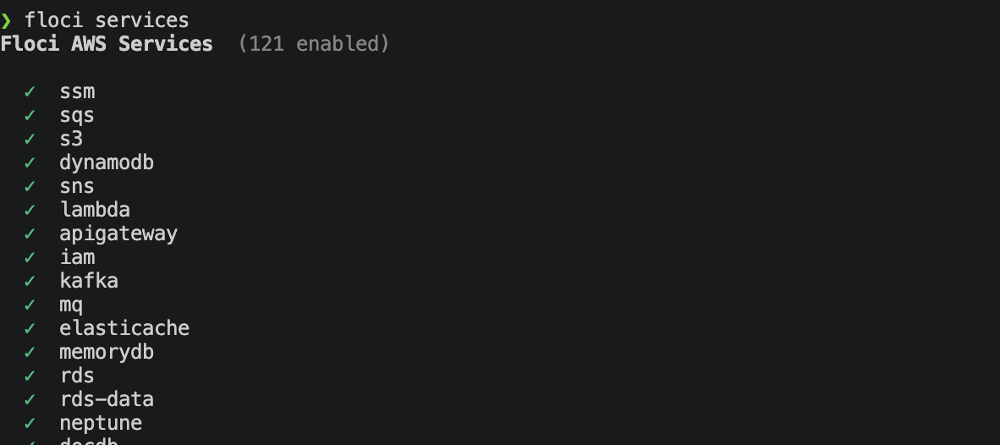
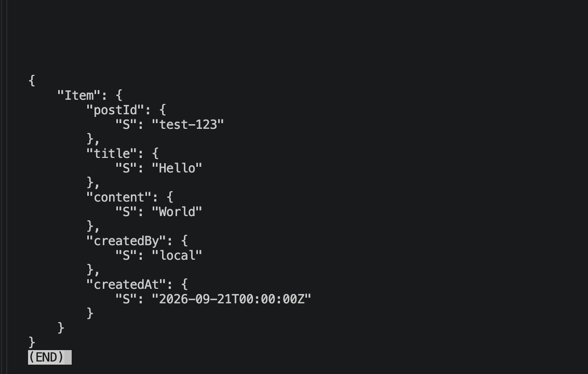
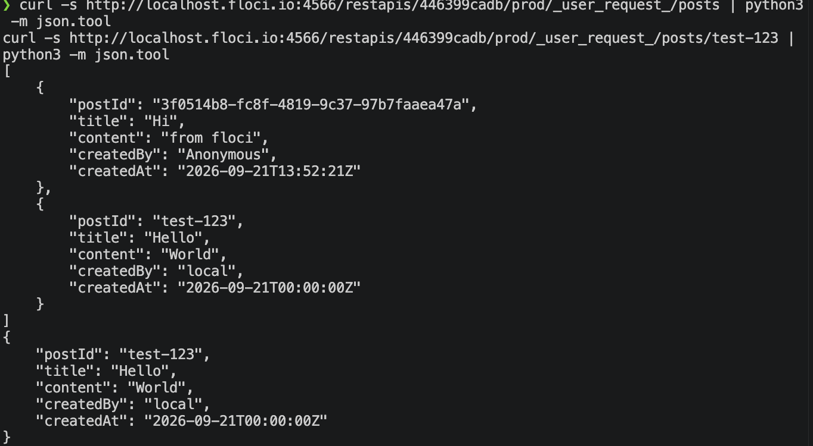
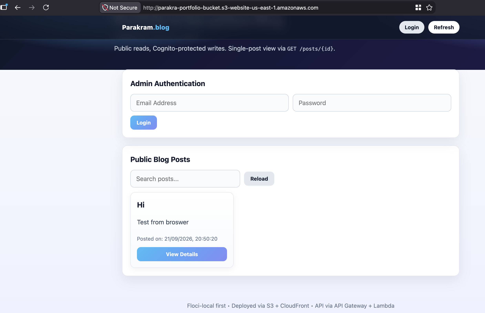
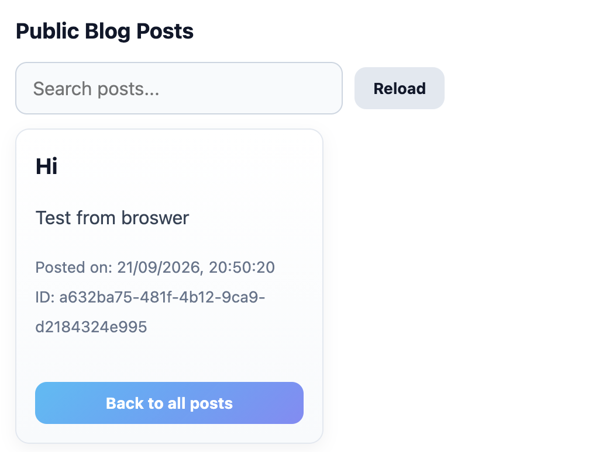
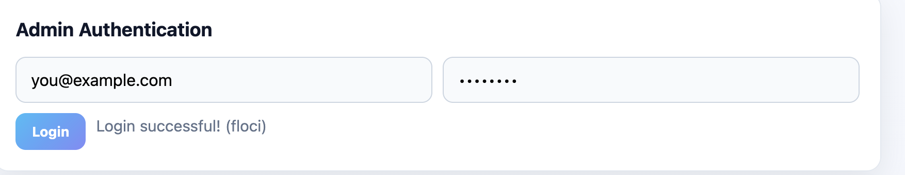
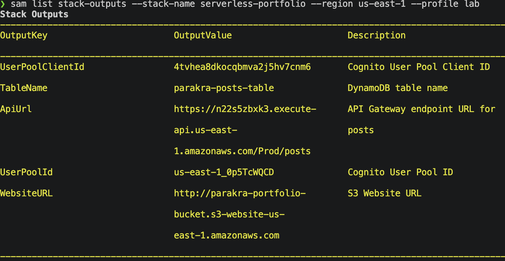

# Serverless Portfolio & Blog

A serverless portfolio and blog platform built with AWS Lambda, API Gateway, DynamoDB, Cognito, and S3. Developed floci-first (local emulation) then deployed to AWS Learner Lab.

**Student:** Parakram Kharel · **Student ID:** parakra · **Region:** us-east-1

<!-- **Live:** [http://parakra-portfolio-bucket.s3-website-us-east-1.amazonaws.com](http://parakra-portfolio-bucket.s3-website-us-east-1.amazonaws.com) -->

---

## Architecture

```
                         ┌─────────────────────────────────────────────────┐
                         │                  AWS Cloud                      │
                         │                                                 │
  ┌──────────┐    ┌──────┴──────┐    ┌──────────────────────────────────┐  │
  │  Browser  │───▶│  S3 Website │    │         API Gateway              │  │
  │           │    │  (static)   │    │  /posts        GET  → public    │  │
  │  index.js │    │  index.html │    │  /posts/{id}   GET  → public    │  │
  │  config.js│    │  main.js    │    │  /posts        POST → Cognito   │  │
  │           │    │  config.json│    └───────┬──────────┬──────────┬───┘  │
  └──────────┘    └─────────────┘            │          │          │      │
                                             ▼          ▼          ▼      │
                                    ┌────────────┐ ┌────────┐ ┌────────┐  │
                                    │ get_posts  │ │get_post│ │create  │  │
                                    │   .py      │ │_by_id  │ │post.py │  │
                                    │ Scan       │ │.py     │ │PutItem │  │
                                    └─────┬──────┘ │GetItem │ └───┬────┘  │
                                          │        └───┬────┘     │       │
                                          ▼            ▼          ▼       │
                                    ┌──────────────────────────────────┐  │
                                    │         DynamoDB                 │  │
                                    │    parakra-posts-table           │  │
                                    │    PK: postId (String)           │  │
                                    └──────────────────────────────────┘  │
                                                                     │    │
                                                                     │    │
                                    ┌──────────────────────────────┐ │    │
                                    │     Cognito User Pool        │◀┘    │
                                    │  parakra-user-pool           │      │
                                    │  User Pool Client            │      │
                                    │  Email login + JWT token     │      │
                                    └──────────────────────────────┘      │
                                    │         LabRole                    │
                                    │  (Learner Lab IAM)                 │
                                    └─────────────────────────────────────┘
```

## 🏗️ Architecture Demo


### Data Flow

| Action | Endpoint | Auth | Lambda | DynamoDB |
|--------|----------|------|--------|----------|
| List posts | `GET /posts` | None | `get_posts.py` → `Scan` | `PostsTable` |
| Get one post | `GET /posts/{id}` | None | `get_post_by_id.py` → `GetItem` | `PostsTable` |
| Create post | `POST /posts` | Cognito JWT | `create_post.py` → `PutItem` | `PostsTable` |

### Frontend Config (runtime, not hardcoded)

`public/config.json` - updated per environment, never committed with real values:

```json
{
  "API_URL": "https://<api-id>.execute-api.us-east-1.amazonaws.com/Prod/posts",
  "USER_POOL_ID": "us-east-1_<pool>",
  "CLIENT_ID": "<client-id>",
  "COGNITO_ENDPOINT": "https://cognito-idp.us-east-1.amazonaws.com"
}
```

`main.js` fetches `config.json` at runtime → sets `API_URL`, `USER_POOL_ID`, `CLIENT_ID`. No rebuild needed.

---

## Project Structure

```
serverless-portfolio/
├── template.yaml              # SAM template (Python 3.12, LabRole)
├── backend/
│   ├── get_posts.py           # Scan all posts (public)
│   ├── get_post_by_id.py      # GetItem by postId (public)
│   └── create_post.py         # PutItem with Cognito authorizer
├── public/
│   ├── index.html             # UI (styled, search, skeleton loading)
│   ├── main.js                # fetchPosts, fetchPostById, login, createPost
│   └── config.json            # Runtime config per environment
├── configure_lab.py           # Local-only credential helper (getpass)
├── steps.md                   # Full replication steps + issues
├── README.md                  # This file
└── samconfig.toml             # SAM deploy defaults
```

---

## Screenshots

### 1. Floci Local Emulation - Services



### 2. DynamoDB - Seed Data



### 3. API Gateway - List + Single Post



### 4. Frontend - Blog Post List



### 5. Frontend - Single Post View



### 6. Cognito - Login Success



### 7. SAM Deploy - Stack Outputs



---


---

## AWS Deploy (Learner Lab)

```bash
unset AWS_ENDPOINT_URL
export AWS_PROFILE=lab
python3 configure_lab.py    # enter lab keys (local, never echoed)

sam validate --template template.yaml --lint
sam build --template template.yaml
sam deploy --template template.yaml --stack-name serverless-portfolio \
  --capabilities CAPABILITY_IAM --region us-east-1 --profile lab \
  --resolve-s3 --parameter-overrides StudentID=parakra

# Get outputs + update config.json
sam list stack-outputs --stack-name serverless-portfolio --region us-east-1 --profile lab
aws s3 sync public/ s3://parakra-portfolio-bucket --region us-east-1 --profile lab

# Create test user
aws cognito-idp admin-create-user --user-pool-id <pool> --username you@example.com \
  --user-attributes Name=email,Value=you@example.com --message-action SUPPRESS \
  --region us-east-1 --profile lab
aws cognito-idp admin-set-user-password --user-pool-id <pool> --username you@example.com \
  --password 'PASSWORD_HERE' --permanent --region us-east-1 --profile lab

# Open site
open http://parakra-portfolio-bucket.s3-website-us-east-1.amazonaws.com
```

---

## Tech Stack

- **Runtime:** Python 3.12 (Lambda)
- **Infrastructure:** AWS SAM, CloudFormation
- **Database:** DynamoDB (PAY_PER_REQUEST)
- **Auth:** Cognito User Pool + API Gateway Authorizer
- **Frontend:** Vanilla JS, CSS (no framework)
- **Local Emulation:** Floci (AWS emulator)
- **Deploy:** `sam deploy` with Learner Lab `LabRole`
